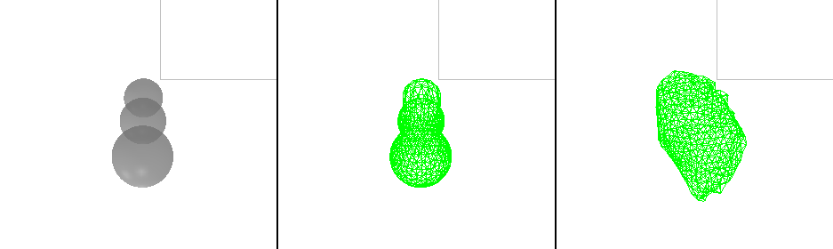
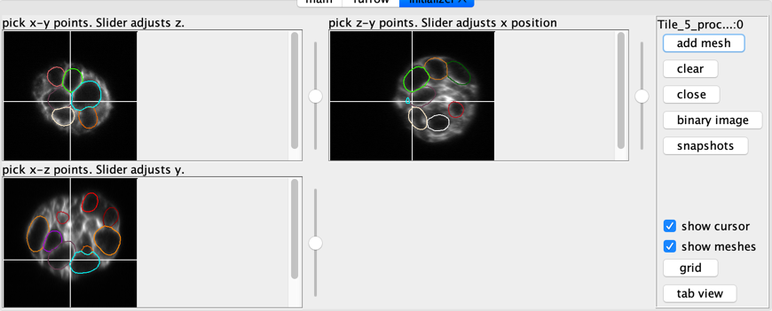

# Deformable Mesh 3D

This is a quick start guide to using our deformable plugin. The goal is to be able to segment 3D timeplapse microscopy movies. Our plugin is an interactive semi-automated technique, where you initialize a mesh then use the image to improve the segmentation.

Segmentations are saved as meshes. They can be used to generate movies or produce measurements of select values.

- [Quick Start / Installation](#quick-start)
- [Mesh Initialization](#mesh-initialization)
- [Deform Mesh to Image Energies](#deform-mesh-to-image-energy)
- [Remeshing](#remeshing)
- [Tracking meshes](#tracking-meshes)
- [Working with multiple channels](#working-with-multiple-channels)
- [Mesh Data](#mesh-data)
- [Javascript console](#javascript-console)
- [Control Panel](#control-panel)
  - main
  - furrow
  - initializer
  - manager
- [Trouble shooting](#trouble-shooting)
- [About](#about)

## Quick Start

The easiest to install the deformable mesh plugin is to add the update site to fiji. Then update and restart. 

https://sites.imagej.net/Odinsbane

Once the plugin has been added, it will be in the menu *plugins->PL_Mesh3D->Deforming Mesh 3D* starts the plugin.

While it is good practice to have the correct pixel units in your image properties. For this plugin to work properly it is important that the x-y
are correct relative to the z units.

## Mesh Initialization

Once the plugin has started threre will be two windows. "DM3D: 3d canvas" and the "DM3D: control panel". The 3d panel is for visualizing the data in 3D.
*It doesn't show the image data by default because it can be slow to initialize, and navigate time frames.*

To create  a new mesh, click the "initialize mesh..." button. A new tab will be available in the control panel called "initializer". The initializer is tied to the currently open image. 

There are 3 orthoganal views of the image. Each view can be zoomed in or out, and the slice location can be moved by using the scroll. By clicking on an image plane a sphere will be started with the center at the location of the click. A second click is required to set the size. Once a sphere has been added it can be moved around by dragging the center handle (green circle), or change the radius by dragging the edge handle (blue circle).

The goal is to approximate the shape of the cell by filling it with spheres. The cell is adequately captured click the button "add mesh" and a mesh will be created.

*It is possible to automatically initialize meshes based on a binary threshold*

## Deform Mesh to Image Energy

An initialized mesh should be a rough approximation of the desired cell. Deforming the mesh has some parameters to set to get an accurate segmentation. Some good default parameters that are good for starting on an image are: "gamma" = 1000, "pressure" = 0, "beta" = 0.1, "alpha" = 1.0 "steric neighbors" = 0. 

The "image weight" can be adjusted based on the image. For this example image, I gaussian blurred the image with a 2px radius and I could use an image energy of 0.01. Without the gaussian blur I need a lower image energy, 0.005. Finding the image weight takes some guess and checks, it is very practical to use the undo feature.

Clicking "deform" will cause the mesh to attempt deform based on an energy derived from the current image. For our example the cell membrane is labeled so we want to select the "&#8869; Max Intensity".

## Remeshing

### Connection Remesh

When a mesh is deforming, it will have unevenly distributed connection lengths. To remedy this we have implemented a remeshing algorithm. Clicking remesh connections will cut all of the long connections in half, and attempt to remove short connections. This allows meshes to much more complicated shapes. 

The minimum and maximum values are in normalized units. Normalized units specify that the longest axis is 1. That can be used as a factor to find what values the min and max should be in real world unts.

### Raycast Remesh

The "raycast remesh" remeshes the current mesh by finding the center of the mesh, then shooting rays out form the center to find the location of points that would fall on the sphere. This is the algorithm used for initializing meshes, (and splitting them). It works well for nearly spherical meshes, but for more convoluted shapes it will start to remove features and have irregular shaped triangles. The number of points on the new mesh is determined by the divisions selector. *This button will probably be removed.*

## Tracking meshes

Tracking involves keeping track of a mesh on for multiple time frames. One use of tracking meshes is to initialize a mesh on subsequent frames. 

When the "DM3D: canvas" windows selected, pressing "t" will track the mesh to the next frame.

To see the tracks select the menu item "tools" -> "manage tracks". A new tab will open with the track manager.

## Working with multiple channels

This app focuses on one channel at a time. If a multi-channel image is selected it will ask which channel to work on. That channel will be the channel used for an image energy, and it will be the channel used to start an initializer. Once an initializer has been started it will continue to point at the same image even if a new image/channel is selected. This lets you intialize meshes based on one image, and deform them to another image. 

For example. I will open an image and select the membrane channel. Then I will start an initializer window. Then I will select another image that has been heavily processed to be a good image energy. Deform my meshes to the new image, but compare them to the image shown in the initializer window. 

## Mesh Data

Mesh data is a set of N points, and assiociated connections and triangles. The data can be written and loaded by the mesh plugin, or by using a small python library.

[binarymeshformat](binarymeshformat.html) demonstrates how to use the python library.

## Javascript console

The javascript console exposes the full java api via java script. It has command completion and keeps track of history.

[javascipt console](javascript-examples.html) has example usage, and links to the java API. 

## Control Panel

### main

  All the parameters and buttons for main. Mostly used for deforming the mesh. Many of the commands are also available through the canvas window.
  
  From the top left and moving right:
  - deform: deforms the currently selected mesh. 
  - clear mesh: clears the currently selected mesh from the current frame.
  - initialize mesh...: opens an initializer tab.
  - raycast remesh: replaces the current mesh with a [raycast remesh](#raycast-remesh).
  - Current image, selected channel and current frame.
  - Previous: moves to previous frame.
  - Next: moves to next frame.
  - Rigid boundaries: keeps mesh confined to image volume.
  - Show Volume: shows the selected image as a volume in the 3d canvas.
  - energy selector: select different types of energy for deforming mesh.
  - show forces: addes vectors depicting the force due to the image energy.
  - Hide Volume: removes the image as a volume.
  - V contrast: brings up a volume contrast dialog.
  - min -+: adjust the minimum cutoff of volume contrast.
  - max -+: adjust the maximum cutoff of volume contrast.
  - connection remesh: [remesh connections](#connection-remesh) of the currently selected mesh.
  The rest are deformation parameters.

### initializer
  These windows allow creating new meshes by adding spheres.
  

### manager
  Manage mesh tracks.
  

### canvas
  3D view that many of the commands can be access through hot keys when the window is selected.
  Press `h` to see available commands.
  

## Trouble shooting

## About

This plugin is based on 3D active contours. Derived from work segmenting biological filaments [1], it is a continuation of a project to measure cell volume in dividing cells overtime. [2] 

[1] "Segmentation and Tracking of Cytoskeletal Filaments using Open Active Contours," M. B. Smith, H. Li, T. Shen, X. Huang, E. Yusuf, and D. Vavylonis, Cytoskeleton 2010.  
[2] "An active contour ImageJ plugin to monitor daughter cell size in 3D during cytokinesis." Smith MB, Chaigne A, Paluch EK. Methods Cell Biol. 2017 
