# DM3D tutorial

This guide provides instructions for segmenting and tracking segmentation meshes for nuclei and membrane using the DM3D segmentation plugin, starting from a two-channel sample image. 

The sections "Segmenting the membrane using original image data" and " Segmenting nuclei using original image data" describes how to obtain segmentation meshes from raw data using active meshes. The sections "Segmenting nuclei using the neural-network predicted distance transform" and 'Creating membrane meshes from nuclei meshes" describe how to obtain segmentation meshes from neural network predictions. This is more efficient, but requires neural network training from ground truth data. The section "Training a neural network" provides guidance on how to generate training data from segmentation meshes and use them to train a neural network. Thus, segmentation meshes and neural network training and prediction can be run iteratively to speed up the segmentation process.

The section "Tracking meshes" explains how to track segmentation meshes in subsequent frames using the DM3D plugin. The section "Manually Scuplting a Mesh" describes DM3D tools which can be used to manually correct meshes.

The example data is a zip file containing three images available 
here [tutorial-data.zip] (https://zenodo.org/record/7544194/files/tutorial-data.zip?download=1). The three images correspond to original image data with a nuclear and membrane label (tile_3.sample.tif; membrane corresponds to the first label or nucleus to the second label), a neural network prediction for nuclei (pred-dna-350nm-tile_3-sample.tif) and a neural network prediction for membranes (pred-membrane-350nm-tile_3-sample.tif). The neural network predictions have three channels, corresponding to predicted borders (outlines of cells and membrane), mask and distance transform. 

## Open an image file.

The tutorial assumes that DM3D is already installed into Fiji. Indications on how to install the plugin are given in the "Supplement" section below.

To use the DM3D plugin, start Fiji and open the provided image file "tile_3-sample.tif". Once the image has loaded, access the plugin menu and select the DM3D plugin to launch the interface. A dialog will appear, prompting you to select a channel. Choose channel 1 to proceed with the segmentation.

## Segmenting the membrane using original image data. 

Once the channel is selected, the corresponding image will load, and the 3D canvas will remain unchanged. Pressing "H" in the 3D canvas will display a list of shortcuts.
The name of the image should appear on the top right of the main control panel. 
On the left side of the panel, a cross-sectional view of the image will be displayed, 
together with a binarized version of the cross section. 

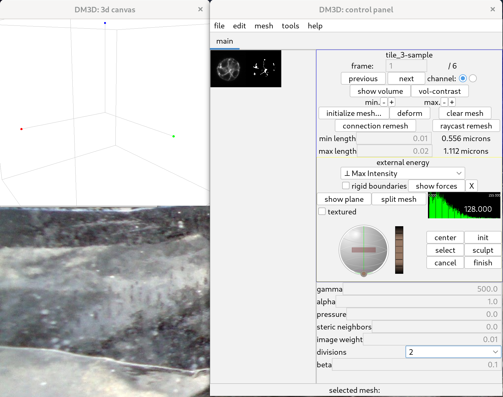

One can then resize the display and zoom in on the slice view, as can be seen below.

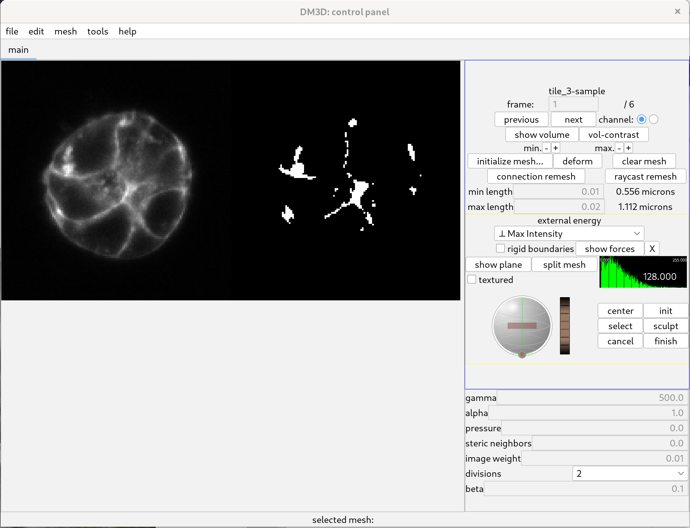

### Initialize meshes.

To initialize a mesh click the button "initialize mesh..."; this will
open a new tab with three orthogonal views of the 3D image.

The aim is to add spheres until they adequately represent the target cell, thereby allowing 
for the initialization of a mesh that can be deformed to match the original 
image data and produce an accurate segmentation.

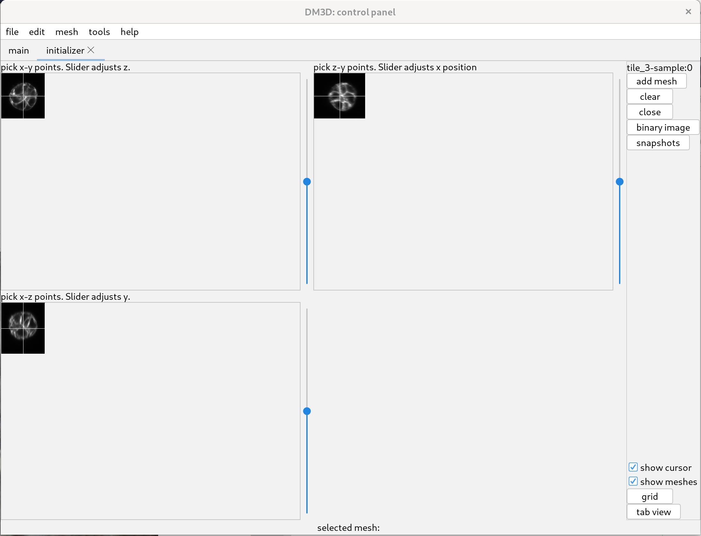

The white lines in the image indicate the position of the other two
views. The slider to the right adjust the position of the view along 
the third axis. To see
the images better, one can zoom by scrolling over the different views.

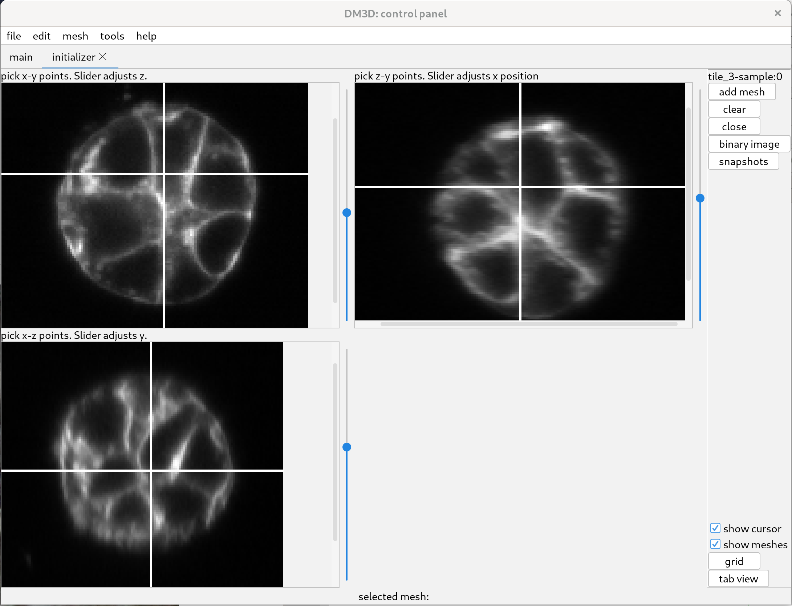

Using the top left initializer, adjust the slider until the image has a 
cell of interest in view, preferably where the cell cross-section is large.

Click near the center of the cross section and a sphere will start to 
be added. Move the cursor to the edge of the cell and click again. That 
will create a sphere which will be used to initialize a mesh.

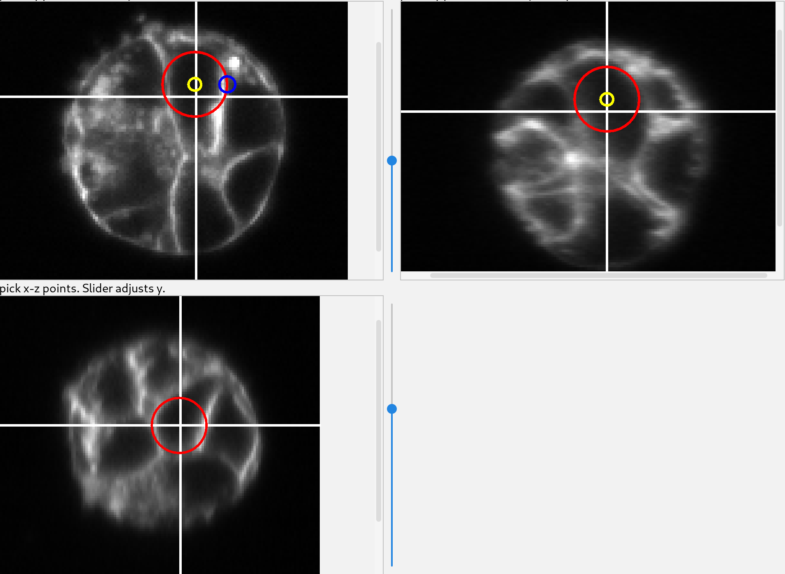

Once the sphere has been created it can be modified using the two colored
circles. Dragging the yellow circle will move the sphere and dragging the
blue circle will change its radius.

Additional spheres can be added to create a more complex shape. The spheres should overlap with each other to subsequently create a single mesh. The figure shows the collection of spheres in the 3 views. 

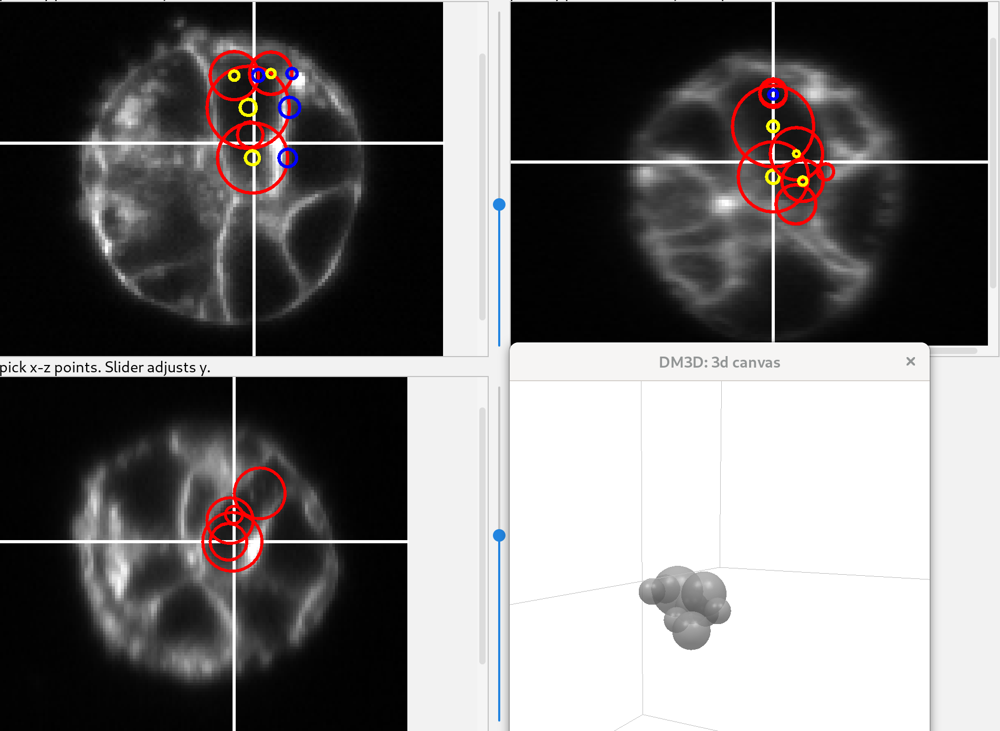

For this image and this cell, this is an adequate guess. Click "add mesh" and
the spheres will change into a new mesh.

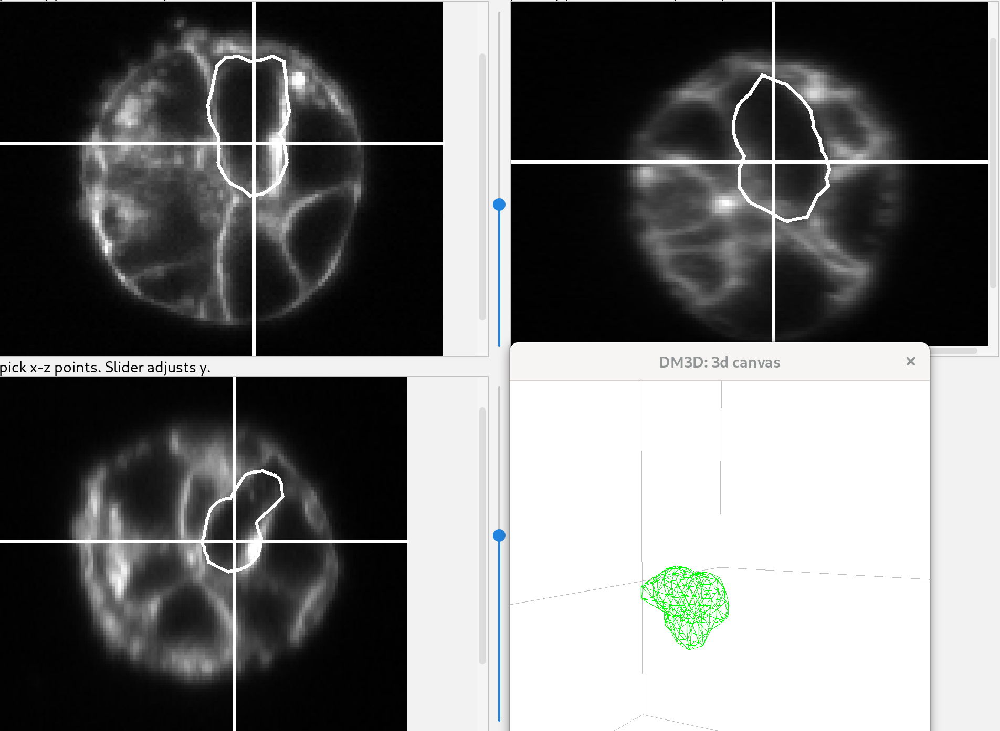

### Deform segmentation meshes.

Go back to the main tab to prepare the interface for deforming the 
initialized mesh to the image. Do not close the initialization tab,
just select the main tab.

Select the "Max Intensity" image energy. This will attract meshes
to bright regions. The parameters should be set as follows:

- gamma: 500
- alpha: 1.0
- pressure: 0
- steric neighbors: 0
- image weight: 0.01
- beta: 0.1

*The surface of the mesh is made visible in the 3D canvas by pressing 'o', 
and the position of the "furrow plane" is adjusted with the controls
on the right side of the panel.*

Click the "deform" button. The shape will quickly settle to a shape that should
capture the membrane well. Click the "stop!" button when the shape has relaxed acceptably since the deformation does not stop
automatically.

After deforming it is good to remesh to improve the distribution of triangles, as follows.
Below the "connection remesh" button, you'll find two values. Set the min 
length to 0.01, and the max length to 0.02. Click the "connection remesh" button, which will redo the mesh to ensure that the triangles are more uniformly distributed.  After the remeshing is complete, click the "deform" button to initiate mesh deformation. Once the mesh has settled and is capturing the membrane adequately, click the "stop" button again to halt the deformation process.

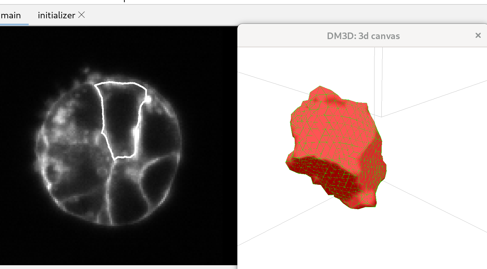

*Applying a gaussian blur to the original image can help deforming meshes.*

## Segmenting nuclei using original image data.

### Initialize a mesh.

Change the channel to the second channel, corresponding to the nuclear label.
Click on the initialize mesh button. A second initialization tab will
open. 

Again add spheres to create a representation of the desired shape.
The shapes of nuclei should be a bit easier to capture with spheres than the membrane shapes.

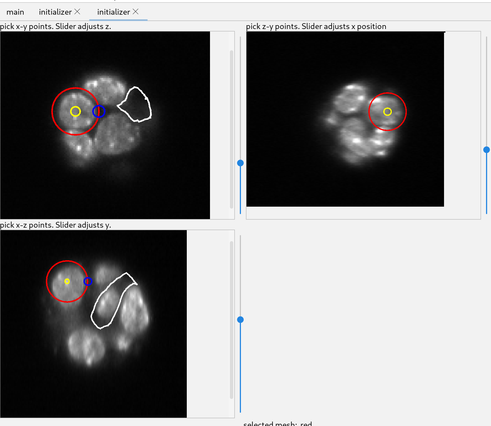

### Deform the mesh.

Selected the "Max Gradient" energy, and **adjust the image weight**.

- gamma: 500
- alpha: 1.0
- pressure: 0
- steric neighbors: 0
- image weight: 0.0001
- beta: 0.1

Next, click the "deform mesh" button to deform the mesh to fit the nuclei. After that, click the "remesh connections" button again to refine the mesh's triangles and ensure a more uniform distribution. Repeat the "deform" and "remesh connections" steps until the mesh has converged and further refinement doesn't improve the segmentation.

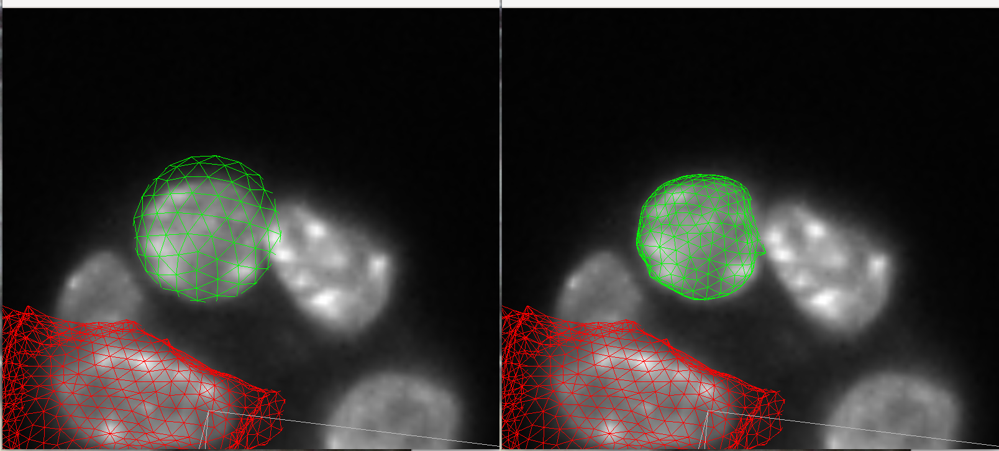

*The 3D canvas display has been updated by clicking the "show plane"
button and checking the "textured" checkbox.*

## Segmenting nuclei using the neural-network predicted distance transform.

The pipeline uses a neural network to obtain a predicted distance transform. We now describe below how to use the predicted distance transform to obtain segmentation meshes.

### Automatically detecting nuclei.

First open the image provided in the tutorial dataset, 
"pred-dna-350nm-tile_3-sample.tif, and select channel 3. This channel corresponds to 
the distance transform prediction of the neural network, for nuclei. Go to the file menu and select "restart meshes".

To detect nuclei, go to the "tools" menu and start the javascript console.
Type in the following command:

    controls.guessMeshes( 3 );

Then click the button "eval".

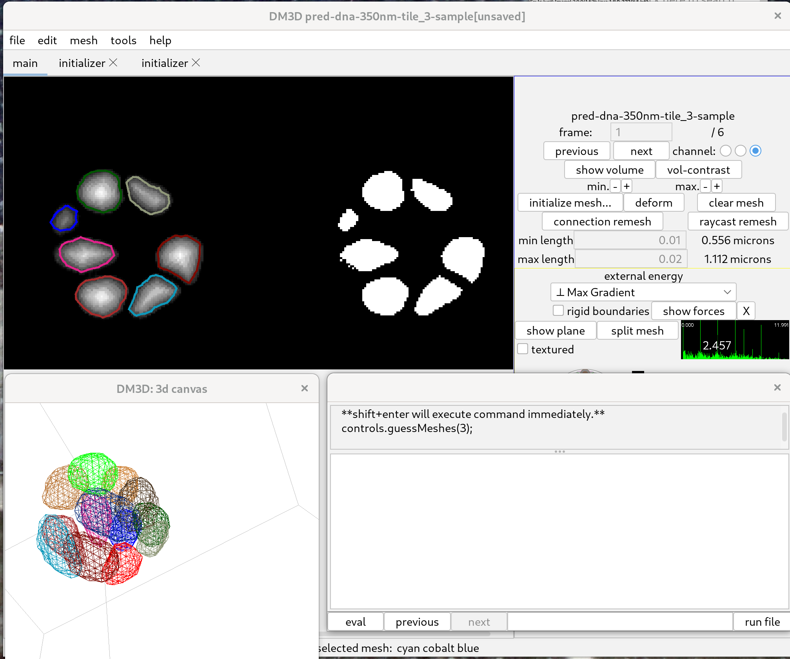

The threshold value, set to "3" by default, determines which threshold of the distance transform value is used to automatically initialise meshes. A smaller value off threshold may result in larger meshes, but which  can potentially merge between different nuclei. A larger value on the other hand may result in two small meshes. The histogram on the control panel can be clicked to evaluate the effect of possible threshold values; visible in the right part of the left panel.

### Deforming meshes to the distance transform.

To then deform segmentation meshes to the distance tranform, select "Max Intensity" in the "external energy" menu, and 
set the image weight to a negative number. A possible set of parameters is as follows: 

- gamma: 500
- alpha: 1.0
- pressure:  0
- steric neighbors: 0
- image weight: -0.1
- beta: 0.1

Then deform all meshes by holding down Control and clicking deform. After
the meshes have deformed and stopped changing significantly, click on 
"stop!".

To further improve the meshes, hold down
control, click "connection remesh" and click deform again. 

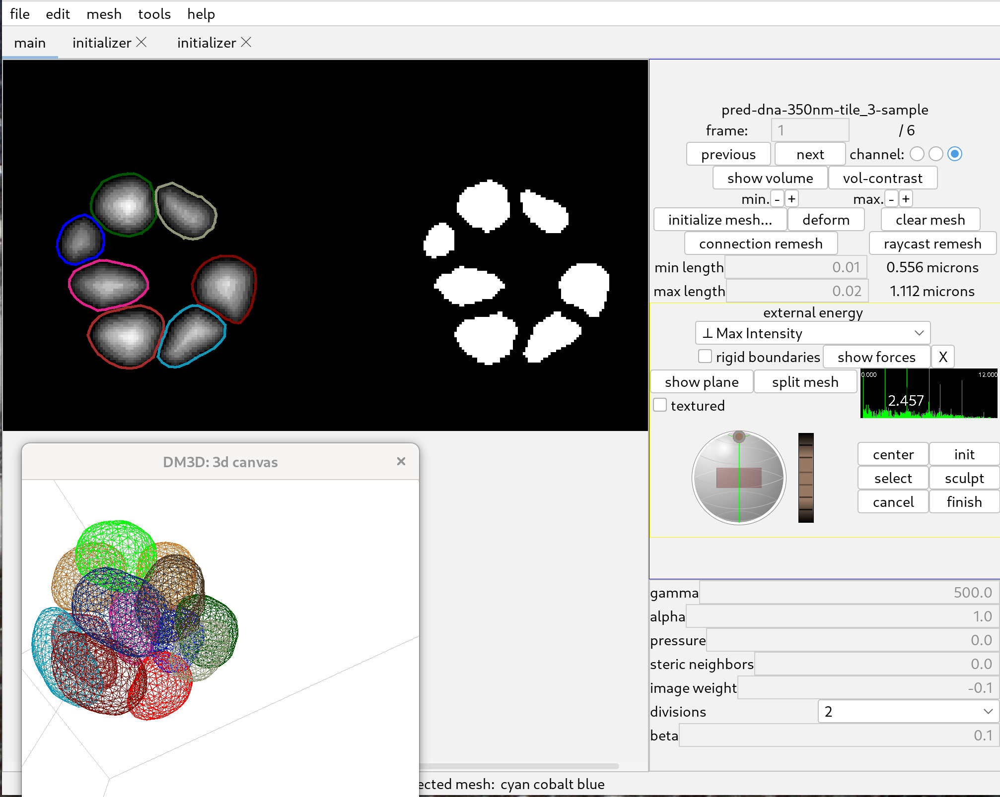

The quality of the segmentations can be verified by using the initializer
window. Sometimes the meshes will be out of sync with what is in 
the initializer window and it can be helpful to run. To uncheck and
then check the "show meshes" checkbox.

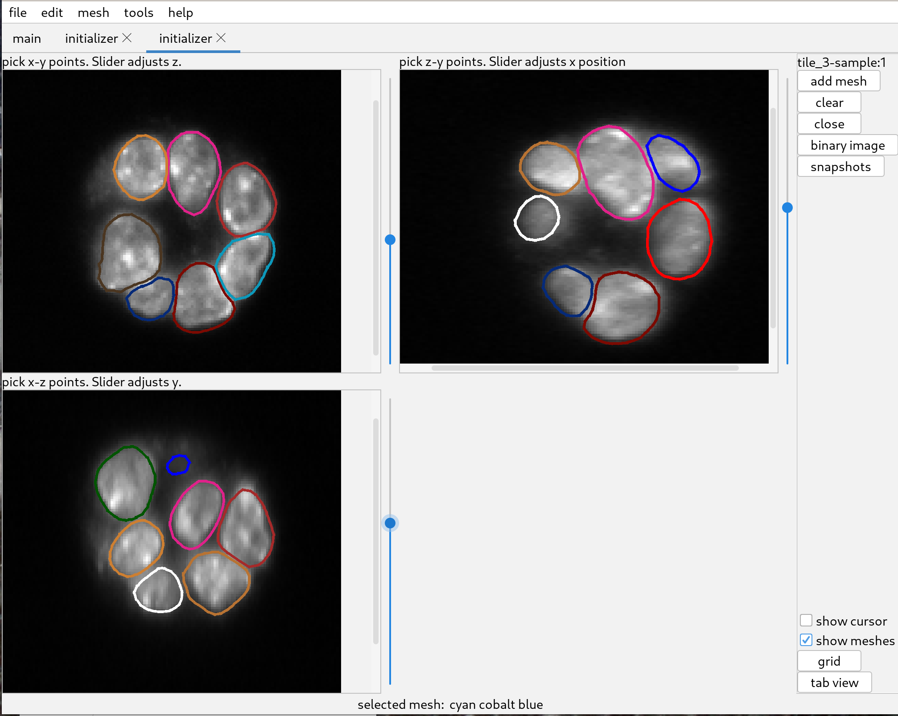

*Please note that the distance transform tends to make meshes a little large, which is
helpful for subsequently deforming the meshes to the original data.*

### Processing all frames.

To process all 6 frames past the following javascript script.

    for( i = 0; i<6; i++){
        controls.toFrame(i);
        controls.guessMeshes(3);
        controls.deformAllMeshes(100);
        controls.reMeshConnectionsAllMeshes(0.01, 0.02);
        controls.deformAllMeshes(100);
    }
    
Click eval. That will go through all 6 frames, guess segmentation meshes, and 
deform them to the distance transform.

**This will process the first frame but it should not create any new meshes.**

## Tracking meshes.

### Autotrack available meshes.

In the "tools" menu select "Manage Tracks". That will start a new tab
to manage the tracks. Tracks can be linked automatically. In the 
javascript console run the following commands:

    controls.toFrame(0);
    controls.autotrackAvailableTracks();

This can be run from any frame (changing the value 0 above to the frame number of interest) and will aim at connecting meshes from the current frame to the next frame.

To do all of the frames in the example data, run the following command:

    for(i = 0; i<5; i++){
        controls.toFrame(i);
        controls.autotrackAvailableTracks();
    }

This successfully tracks all of the meshes in this example.

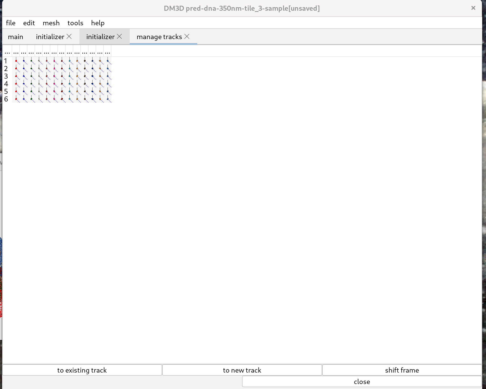

## Creating membrane meshes from nuclei meshes.

Once the nuclear meshes are tracked, open the image 
"pred-membrane-350nm-tile_3-sample.tif" and select channel 3 as before. This will open the predicted distance transform by the neural network, but now for cell membranes.

To segment the membrane using the nuclear meshes as a starting point, we apply the same method but deform the meshes to the distance transform. The following parameter values can be used:

- gamma: 500
- alpha: 1.0
- pressure: 0
- steric neighbors: 0
- image weight: -0.1
- beta: 0.1

To deform the meshes, hold down the control key and click "deform". Once the meshes have settled to a good shape, click "stop!" and "connection remesh". Finally, click "deform" again to refine the segmentation.

Since this process is iterative, it is helpful to write a script which can be executed in the javascript console:

    for( i = 0; i<6; i++){
        controls.toFrame(i);
        controls.deformAllMeshes(100);
        controls.reMeshConnectionsAllMeshes(0.01, 0.02);
        controls.deformAllMeshes(100);
        controls.reMeshConnectionsAllMeshes(0.01, 0.02);
        controls.deformAllMeshes(100);
        controls.reMeshConnectionsAllMeshes(0.01, 0.02);
        controls.deformAllMeshes(100);
    }
    
Once this automatic process is executed, one can verify the outcome by eye by going through the frames. It is important to use the original data for verifying the quality of the
meshes. That is why it is convenient to have multiple initialization 
tabs open.
 
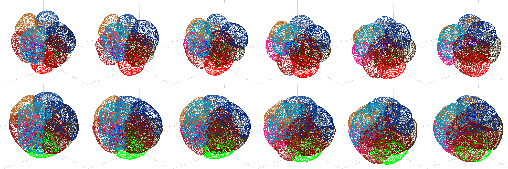

Here is a comparison of the nuclei meshes and the meshes after deforming to
the membrane distance transform. The montage was created using tools->record snapshots then using ImageJ.

## Manually scuplting a mesh.

If a mesh is not deforming to the desired shape, it may be necessary to modify it manually. 
To do this, first select the mesh that you want to sculpt and click the "select" button. This will activate the mesh modifier. 
Then, click on "sculpt" to enter sculpt mode. Then, click on "sculpt" to enter sculpt mode. In this mode, you can move the mouse over the slice view, and a circle (sphere) will appear that you can move around by clicking and dragging. By positioning the circle over nodes of the mesh and dragging, you can sculpt the mesh by moving its nodes to new positions.

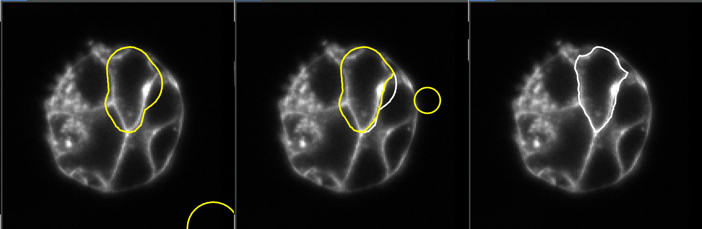

The yellow version of the mesh is the updated mesh, and the white version
is the old mesh.

When the mesh has been deformed sufficient click "finish" to accept the 
changes. Or click "cancel" if you don't like the results.

You can also view/edit in 3D, click "show plane" button and check the 
"show textured box.

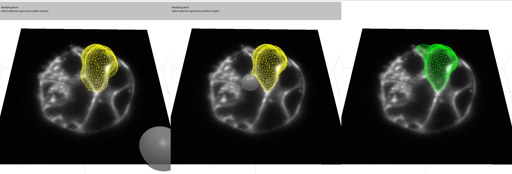

Spheres will indicate the mesh is moving, but the changes will not appear
until the mouse is released.

#### Caveats.

- Only nodes are sculpted, not lines or triangles.
- When the mouse is pressed, any nodes within the sphere will not be moved.
  Only nodes that start outside the sphere will be move.
- When "select" is pressed you can restrict the nodes that will be
  modified by moving the sphere over them and clicking. Clicking more
  will accumulate more selected nodes. Only the selected nodes can 
  subsequently be modified.
- Only the shape created with "finish" is part of the undo stack. 

## Training a neural network.

**Requires a cuda enabled graphics card.**

To run the neural network, [ActiveUnetSegmentation](https://github.com/FrancisCrickInstitute/ActiveUnetSegmentation) needs to be installed.

Once a set of segmentation meshes are obtained and are acceptable, it can be used to create training data 
and train a model.

To do so, create a folder somewhere, and save the file [example-d3.json](example-d3.json)
to the folder. **Please note that the name matters.**.

### Create training data.

First select the image that is going to be the input image. In the
menu "file", "select open image" and choose "tile_3-sample.tif".

It will use the original ImagePlus to derive the
input training data. In our case it is 2 channel volume data. Run 
the following function in the javascript console.

    controls.generateTrainingData(0, 5);
    
Then select the training folder that the config file was saved in. Two 
additional folder will be created with the "images", "labels". Inside 
of the folders there will be six tif files; one for each time point.

### Create a model.

Next one needs to create the model. Activate a python environment with
[ActiveUnetSegmentation](https://github.com/FrancisCrickInstitute/ActiveUnetSegmentation)
installed.

    cerberus create -c example-d3.json
    
There will be a lot of options, but the .json is already setup for
this specific dataset. So just clicking ok all of the menus the program
should finish, and there will now be a "example-d3.h5".

    cerberus train -c example-d3.json
    
There will be some options, but they should be set already for the 
specific model/dataset to work.

As the training runs, a file "batch-log_example-d3-123456789ab.txt" will be
created. It gets updated at the end of each batch for the first 5000 
batches. A file "training-log_example-d3-0123456789ab.txt" will be created 
at the start of training, and updated at end of each epoch. 

When an epoch finishes a new file "example-d3-latest.h5" will be created.

### Continuing training.

To restart or continue training from a save model, name the model the
same as the .json file. with .h5 instead:

    mv example-3-latest.h5 example-d3.h5
    
That will overwrite the previous example-3.h5. Then executing the command: 

    cerberus train -c example-d3.json 

will start training from the previously trained model.

### Making a prediction.

To make a prediction, use the following command:

    cerberus predict example-3-latest.h5 tile_3-sample.tif

Using the default options, the output, pred-example-3-latest-tile_3-sample.tif, 
looks decent after a couple of epochs. 

*Making a prediction from the training data does not demonstrate the quality of
the model, it is rather a demonstration that things are working.*

### Additional Models

We have published a dataset at Zenodo, [Mouse organoid dataset](https://zenodo.org/record/7544194) there
are four models there that we have used. They all use [dna-350nm.json](dna-350nm.json)
as a config file. The main difference between the four models is the
data they have been trained on.

## Supplement

### Adding DM3D to fiji.

- Start Fiji and got to the help menu.
- From the help menu select update. Fiji will check for updates.
- Click the button that says "manage update sites".
- The name does matter, double click on the name to change it to "DM3D"
- Double click on the URL field and change it to: https://sites.imagej.net/Odinsbane/.
- Update Fiji.

### Improving deforming meshes.

When meshes deform poorly:

- adjust parameters.
- re-initialize the mesh to be a better guess.
- filter the original image.
- Manually edit meshes.

### Notes

The parameters provided for mesh updating are the result of trial and error. To test for these parameters, one can click on "deform" after initializing the mesh, and depending on the results, adjust some of the parameters to achieve better deformation. In case the mesh deforms very poorly, the 'undo' function can be used to revert to the previous state.

### Troubleshooting

- Q: Initialization window seems frozen. Cannot add spheres or see meshes.
- A: Is the UI blocked on some task, like a deforming mesh or changing
a parameter? Check the main control tab.

