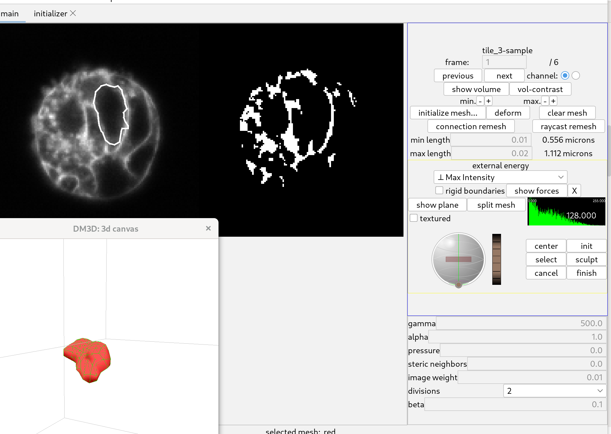

# DM3D tutorial

This guide starts with a two channel sample image and demonstrates how
to segment and track the meshes. It assumes that you have installed
the dm3d into fiji, if not check 

## Open a file
The example data is a zip file containing three images available 
here [tutorial-data.zip](https://zenodo.org/record/7544194/files/tutorial-data.zip?download=1)

Start fiji and open the provided image file: "tile_3-sample.tif". Once 
the image has loaded you can start the DM3D plugin from the plugin
menu. After which the DM3D interface will start and a dialog will come 
asking you to select a  channel. Select channel 1.

## Segmenting the membrane. 

After selecting the channel, the image is loaded. Nothing changes in
the 3D canvas. On the main control panel, the name of the image should
appear on the top right. The view on the left will show a cross section
of the image, and a binarized version of the cross section to the 
right.

I resize the display and zoom in on the slice view.

### Initialize meshes.

The goal is to add spheres until they represent the target cell enough
to initialize a mesh that will deform to the original image data to
produce an acceptable segmentation.

To initialize a mesh click the button "initialize mesh..." this will
open a new tab with three orthoganal views of the 3D image.

The white lines in the image indicate the position of the other two
views. The slider to the right adjust the position of the view along 
the third axis. I zoom by scrolling over the different views to see
the images better.

Using the top left initializer, adjust the slider until the image has a 
cell of interest in view preferably where the crossection is largets.

Click near the center of the cross section and a sphere will start to 
be added. Move the cursor to the edge of the cell and click again. That 
will create a sphere which will be used to initialize a mesh.

Once the sphere has been created it can be modified with the two colored
circles. Dragging the yellow circle will move the sphere and dragging the
blue circle will change the radius.

The figure shows the collection of spheres in the 3 views. 

For this image and this cell, this is an adequate guess. Click "add mesh" and
the spheres will change into a new mesh.

### Deform mesh.

Go back to the main tab to prepare the interface for deforming the 
initialized mesh to the image. (Do not close the initialization tab
just select the main tab.)

Select the "Max Intensity" image energy. This will attract meshes
to bright regions. The parameters should be set as follows

- gamma: 500
- alpha: 1.0
- pressure: 0
- steric neighbors: 0
- image weight: 0.01
- beta: 0.1

*I have made the surface of the mesh visible in the 3D canvas by pressing 'o', 
and I have adjusted the position of the "furrow plane" with the controls
on the right side of the panel.*

Click deform. The shape will quickly settle to a shape that should
capture the membrane well. Click stop! The deformation does not stop
automatically.

After deforming it is good to remesh to improve the triangle distribution.
Below "connection remesh" button there are two values. Set the min 
lenth to 0.01 and the max length to 0.02.

Click the "connection remesh" button. That will redo the mesh so that the triangles 
are more uniform. Then click deform and when the mesh stops deforming
click stop again.

*Applying a gaussian blur to thoriginal image can help deformations.*

## Segmenting a nucleus

### Initialize a mesh.

Change the channel to the second channel, the dna channel.
Click on the initialize mesh button. A second initialization tab will
open. 

Again add spheres to the create a representation of the desired shape,
the dna shapes should be a bit easier to capture with spheres.

### Deform the mesh

Selected the "Max Gradient" energy, and **adjust the image weight**.

- gamma: 500
- alpha: 1.0
- pressure: 0
- steric neighbors: 0
- image weight: 0.0001
- beta: 0.1

Then click deform mesh. This should deform to the nuclei. Again use
the "remesh connections" button, and "deform" again to refine the shape
of the mesh until it is not improving any more.

*The 3D canvas display has been updated by clicking the "show plane"
button and checking the "textured" checkbox.*

## Using the distance transform.

### Automatically detecting nuclei.

First open the image provided in the tutorial dataset, 
"pred-dna-350nm-tile_3-sample.tif".and select channel 3. That is 
the distance transform. Go to the file menu and select "restart meshes"

To detect nuclei, go to the "tools" menu and start the javascript console.
Type in the command.

    controls.guessMeshes( 3 );

Then click the button "eval".

The value "3" is a threshold value. A small number will predict larger
meshes, but sometimes they can be merged. A large number will predict
smaller meshes. On the control panel, clicking on the histogram 
can help to show how well the threshold value works.

### Deforming meshes to the distance transform.

To deform to the distance tranform select a "Max Intensity" and 
set the image weight to a negative number. 

- gamma: 500
- alpha: 1.0
- pressure:  0
- steric neighbors: 0
- image weight: -0.1
- beta: 0.1

Then deform all meshes by holding down Control and clicking deform. After
the meshes have deformed and stopped changing significantly, click on 
"stop!".

That will refine the shapes, to further improve the meshes. Hold down
control and click "connection remesh" and click deform again. 

The quality of the segmentations can be verified by using the initializer
window. Sometimes the meshes will be out of sync with what is in 
the initializer window and it can be helpful to run. To uncheck and
then check the "show meshes" checkbox.

*The distance transform tends to make meshes a little large, which is
good for subsequently deforming the meshes to the original data.*

### Processing all frames

To process all 6 frames past the following javascript script.

    for( i = 0; i<6; i++){
        controls.toFrame(i);
        controls.guessMeshes(3);
        controls.deformAllMeshes(100);
        controls.reMeshConnectionsAllMeshes(0.01, 0.02);
        controls.deformAllMeshes(100);
    }
    
Click eval. That will go through all 6 frames, guess the meshes, and 
deform them.

**This will process the first frame but it shouldn't create any new meshes.**

## Tracking meshes

### Autotrack available meshes.

In the "tools" menu select "Manage Tracks". That will start a new tab
to manage the tracks. Tracks can be linked automatically. In the 
javascript console run.

    controls.toFrame(0);
    controls.autotrackAvailableTracks();

This can be run from any frame and it tries to find meshes in the next frame.

To do all of the frames.

    for(i = 0; i<5; i++){
        controls.toFrame(i);
        controls.autotrackAvailableTracks();
    }

This successfully tracks all of the meshes in this example.

## Creating membrane meshes from DNA meshes.

Once the nuclear meshes are tracked. Open the image. 
"pred-membrane-350nm-tile_3-sample.tif" and select channel 3 again.

This involves the same method for the dna but we're starting from 
the dna meshes and deforming them to the distance transform.

- gamma: 500
- alpha: 1.0
- pressure: 0
- steric neighbors: 0
- image weight: -0.1
- beta: 0.1

Then hold control and click "deform". After meshes have slowed down, 
click "stop!" and "connection remesh" and start deforming again.

Since this is iterative, I script it. Then go through and find problems.

    for( i = 0; i<6; i++){
        controls.toFrame(i);
        controls.deformAllMeshes(100);
        controls.reMeshConnectionsAllMeshes(0.01, 0.02);
        controls.deformAllMeshes(100);
        controls.reMeshConnectionsAllMeshes(0.01, 0.02);
        controls.deformAllMeshes(100);
        controls.reMeshConnectionsAllMeshes(0.01, 0.02);
        controls.deformAllMeshes(100);
    }

Here is a comparison of the DNA meshes and the meshes after deforming to
the membrane distance transform.

The montage was created using tools->record snapshots then using imagej.

It is important to use the original data for verifying the quality of the
meshes. That is why it is convenient to have multiple initialization 
tabs open.

## Manually Scuplting a Mesh.

Sometimes a mesh isn't deforming to the shape you want. Maybe it is 
stuck on something, maybe there is an artifact. This is a way to
modify the mesh manually.

Select the mesh you want sculpt. Click on the "select" button. That 
activates the mesh modifier. Then click on "sculpt" that starts scuplt
mode. Move the mouse over the slice view and a circle (sphere) will move
around. By clicking and dragging the circle to intersect nodes of the mesh
they will be moved around. "scuplted" if you will.

The yellow version of the mesh is the updated mesh, and the white version
is the old mesh.

When the mesh has been deformed sufficient click "finish" to accept the 
changes. Or click "cancel" if you don't like the results.

You can also view/edit in 3D, click "show plane" button and check the 
"show textured box.

Spheres will indicate the mesh is moving, but the changes won't appear
until the mouse is released.

#### Caveats

- Only nodes are sculpted, not lines or triangles so the results may vary.
- When the mouse is pressed, any nodes within the sphere will not be moved.
  Only nodes that start outside.
- When "select" is pressed you can restrict the nodes that will be
  modified by moving the sphere over them and clicking. Clicking more
  will accumulate more selected nodes. Only the selected nodes can 
  subsequently be modified.
- Only the shape created with "finish" is part of the undo stack. 

## Training a neural network.

**Requires a cuda enabled graphics card.**
To run the neural network, [ActiveUnetSegmentation](https://github.com/FrancisCrickInstitute/ActiveUnetSegmentation) needs to be installed.

Once we have a set of meshes that look good we can create training data 
and train a model.

Create a folder somewhere, and save the file [example-d3.json](example-d3.json)
to the folder. **the name matters**.

### Create training data

First select the image that you want to be your input image. In the
menu "file", "select open image" and choose "tile_3-sample.tif".

It will use the original ImagePlus to derive the
input training data. In our case it is 2 channel volume data. Run 
the following function in the javascript console.

    controls.generateTrainingData(0, 5);
    
Then select the training folder that the config file was saved in. Two 
additional folder will be created with the "images", "labels". Inside 
of the folders there will be six tif files. One for each time point.

### Create a model

Next we need to create the model. Activate a python environment with
[ActiveUnetSegmentation](https://github.com/FrancisCrickInstitute/ActiveUnetSegmentation)
installed.

    cerberus create -c example-d3.json
    
There will be a lot of options, but the .json is already setup for
this specific dataset. So just clicking ok all of the menus the program
should finish, and there will now be a "example-d3.h5".

    cerberus train -c example-d3.json
    
There will be some options, but they should be set already for the 
specific model/dataset to work.

As the training runs, a file "batch-log_example-d3-123456789ab.txt" will be
created. It gets updated at the end of each batch for the first 5000 
batches. A file "training-log_example-d3-0123456789ab.txt" will be created 
at the start of training, and updated at end of each epoch. 

When an epoch finishes a new file "example-d3-latest.h5" will be created

### Continuing Training

To restart or continue training from a save model, name the model the
same as the .json file. with .h5 instead.

    mv example-3-latest.h5 example-d3.h5
    
That will overwrite the previous example-3.h5, and then 

    cerberus train -c example-d3.json 

Will start training from the previously trained model.

### Making a prediction

To make a prediction

    cerberus predict example-3-latest.h5 tile_3-sample.tif

I use the default options and the output, pred-example-3-latest-tile_3-sample.tif, 
looks decent after a couple of epochs. 

*Making a prediction from the training data doesn't show the quality of
the model, it is more a demonstration that things are working.*

### Additional Models

We have published a dataset at Zenodo, [Mouse organoid dataset](https://zenodo.org/record/7544194) there
are four models there that we have used. They all use [dna-350nm.json](dna-350nm.json)
as a config file. The main difference between the four models is the
data they have been trained on.

## Supplement

### Adding DM3D to fiji.

- Start Fiji and got to the help menu.
- From the help menu select update. Fiji will check for updates
- Click the button that says "manage update sites"
- The name doesn't matter, double click on the name to change it to "DM3D"
- Double click on the URL field and change it to: https://sites.imagej.net/Odinsbane/
- Update Fiji

### Improving deforming meshes.

When meshes deform poorly.

- adjust parameters.
- re-initialize the mesh to be a better guess.
- filter the original image.
- Manually edit mesh.

### Notes

These parameters were found by guessing and checking. Once the mesh
is initialized I click deform. Then depending on how the mesh deforms
I adjust some parameters and try to get it to deform better.

If the mesh deforms very poorly I use undo.

### Troubleshooting

- Q: Initialization window seems frozen. Cannot add spheres or see meshes.
- A: Is the UI blocked on some task, like a deforming mesh or changing
a parameter? Check the main control tab.

